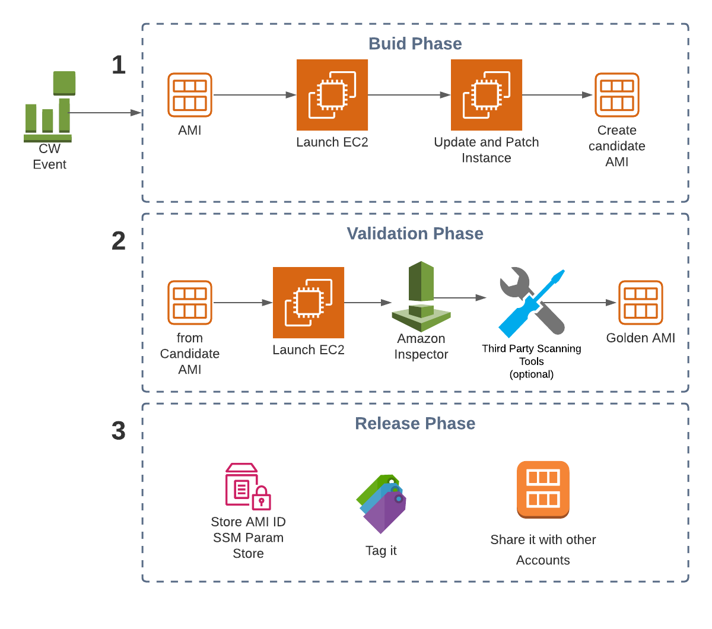

# Golden AMI Workflow
This workflow is based on AWS System Manager Automation it provides most of the steps required in the Automation Document `AWS-UpdateLinuxAMI`. The following workflow is based on [Building a Secure, Approved
AMI Factory Process Using Amazon
EC2 Systems
Manager (SSM)](https://d1.awsstatic.com/whitepapers/aws-building-ami-factory-process-using-ec2-ssm-marketplace-and-service-catalog.pdf)

1. **Build Phase**: We set up a Cloudwatch Event that will trigger (recommended every 2-3 weeks) System Manager Automation, This document will launch an EC2 instance taking as a parameter the latest AMI-ID (stored in SSM Parameter Store). Automation will verify that the SSM agent is installed on the instance, update and patch the instance and finally will create a candidate AMI

2. **Validation Phase**: using the candidate AMI created in step 1. an EC2 instance and run Amazon Inspector, this will run an assessment on the instance and generate a report with findings. Optional during the this phase we can also run third party tools or scripts (e.g. Nessus Scan)

3. **Release Phase**: After the validation phase the SSM parameter Store for the latest AMI is updated, we tag the AMI according to the business policies and share it with other accounts in the organization.

## Recomendations
- Is recommended to have a dedicated AWS publisher account in your organization that will trigger the Golden AMI Flow and share the Golden AMI with the rest of your accounts
- CW Events and Lambda is recomended to Automate Validation and Release phase 
