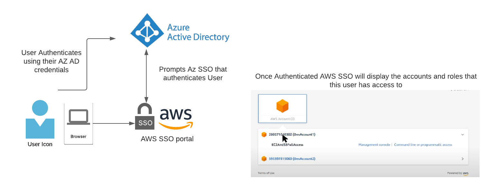

# Enterprise IAM solution 
When implementing an enterprise IAM solution the recommended way is to use AWS Single Sign On (AWS SSO) as this provides:
- Enables companies to integrate their Enterprise Identity Provider (IDP) with AWS. The credentials are not stored in AWS, they stay in the Enterprise IDP, This solution allow users to experience the benefits of SSO(login once and get access to everything I have access)
- AWS SSO integrates with AWS Organizations, which allow us to group accounts into Organizational Units (OU) and implement policies at he OU level, Having more control over a group of accounts.
- Using AWS SSO we define Groups and Permissions Sets(Which is a collection of permissions assigned to a Role) and assign these Groups to accounts so users have access to the account thorugh an IAM role.

The following is a representation of an user login using AWS SSO usign Azure AD as IDP
