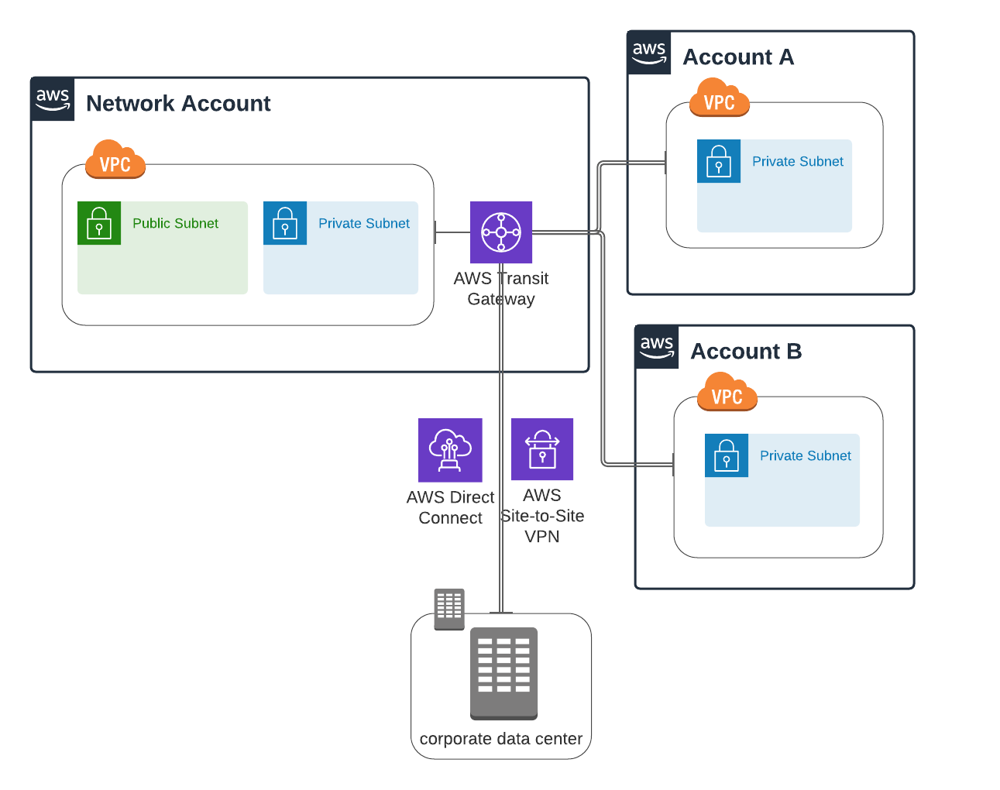

# Network Topology Redesign

**AWS Direct Connect**: This will speed up data transfer between OnPrem and AWS(up to 10Gps), it can also save costs if the data transfers quotas are in the terabytes range, Traffic between onPrem and AWS goes through a dedicated connection isolated from the public internet which secures the data from spoofing or man-in-the-middle attacks

**AWS Transit Gateway**: This will the single piece of connectivity betwenn VPCs, OnPrem and Public Internet(for VPCs only not the onPrem datacenter) reducing the number of connections and configurations we have to manage, it will substitute the VPC-Peering connections and VPN attachments (we keep the VPN as fail over mechanism). In the future if we need to add another account or VPN we can use the same transit Gateway.   

**Dedicated Network Account**: This will allow us to have a single point of ingress and egress for traffic on our network, Transit Gateway will be configured in this account and shared with the other accounts. By having a dedicated Nework account it will be easy to monitor and secure the traffic of all the accounts in a centralized manner. 

## Migration Strategy and Recommendations
- Because we were previously using VPC-Peering our IP ranges are not overlapping between the the two VPCs and it should be transparent for us.
- Create a Transit Gateway Route Table to configure routing for your transit gateway attachments in the Network Account
- For the spoke accounts: In the route tables change the target from the virtual private gateway to the new Transit Gateway
- Delete the VPN Connections in the spoke accounts
